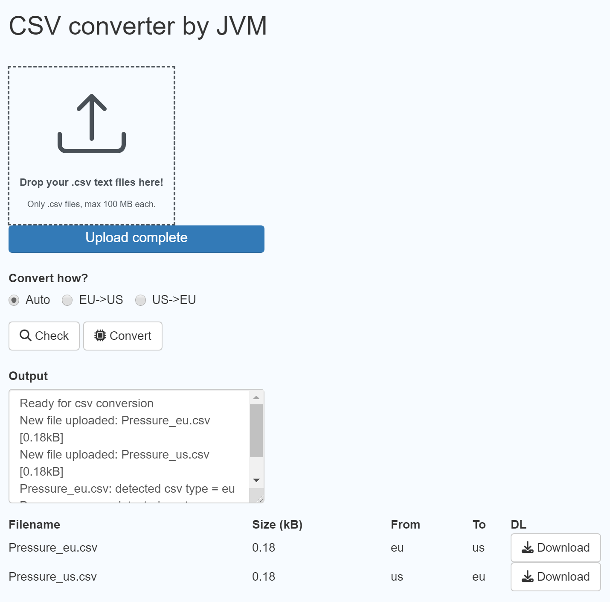

# csv_converter
R shiny app to convert CSV files between EU and US

## screenshots
[](doc/screenshot_01.png)

## How to deploy
### Docker
```
docker build -t csv_converter .
docker run -p 8000:8000 --name csv_converter csv_converter
```